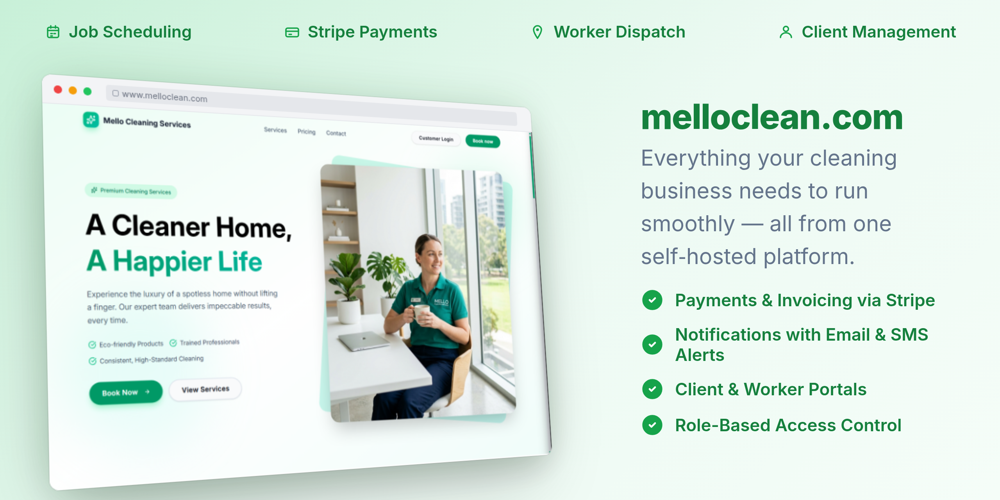

[](https://melloclean.com)

## Getting Started

### Installation

```bash
npm install
```

### Development

Start all applications, including the ASP.NET Core server, with hot reload:

```bash
npm run dev
```

The API listens on port 5000. To run only it directly (with .NET 10 installed):

```bash
dotnet watch --project apps/server/MelloClean.Server/MelloClean.Server.csproj run
```

## Building for Production

Create a production build:

```bash
npm run build
```

Run the server tests directly:

```bash
dotnet test apps/server/MelloClean.Server.sln
```

## Deployment

### Docker

```bash
cp .env.example .env
npm run dev:start
```

The `apps/server/package.json` workspace is an orchestration adapter for Turbo; the server runtime and
dependencies are managed by .NET. Configure `APPWRITE_ENDPOINT`, `APPWRITE_PROJECT_ID`, optional
`APPWRITE_SESSION_API_KEY` (with `sessions.write`), and the exact-origin `CORS_ORIGINS` allowlist in
`.env`. The legacy `APPWRITE_ACCOUNT_CREATION_API_KEY` name remains accepted during migration.
